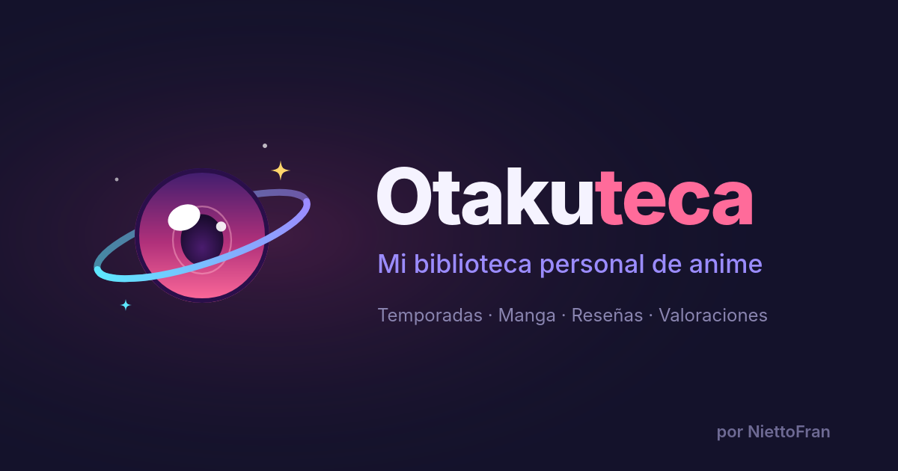

<div align="center">

<a href="https://otakuteca.ntech.studio">
  
</a>

<a href="https://otakuteca.ntech.studio">
  
</a>

<br />


<br />
<br />

<a href="https://otakuteca.ntech.studio"></a>
<a href="CHANGELOG.md"></a>
<a href="specs/001-otakuteca-catalog/spec.md"></a>

</div>

---

## Qué es esto

Otakuteca es un catálogo digital **personal y público** para centralizar y compartir mi historial
de anime y manga. Tiene dos caras:

- **Vista pública** de solo lectura: cualquiera puede recorrer el catálogo sin registrarse,
  filtrarlo y compartir el link de una obra.
- **Panel `/dashboard`** protegido, donde el único administrador carga, edita y borra obras,
  gestiona géneros y arma el ranking.

> **Todo se carga a mano, a propósito.** No hay integraciones con MyAnimeList, AniList ni Kitsu, ni
> portadas o metadatos traídos automáticamente: cada obra, reseña y puntaje lo escribo yo.

### Recorrido

<div align="center">

| Sección         | Ruta                                                           | Qué vas a encontrar                                 |
| :-------------- | :------------------------------------------------------------- | :-------------------------------------------------- |
| 🏠 Inicio       | [`/`](https://otakuteca.ntech.studio)                          | Contadores, favoritas, lo último y accesos directos |
| 📺 Animes       | [`/animes`](https://otakuteca.ntech.studio/animes)             | Grilla de animes con filtros por estado y favoritas |
| 📚 Mangas       | [`/mangas`](https://otakuteca.ntech.studio/mangas)             | Grilla de mangas con los mismos filtros             |
| 🏆 Ranking      | [`/ranking`](https://otakuteca.ntech.studio/ranking)           | Mi top 10 de animes, con podio                      |
| 📊 Estadísticas | [`/estadisticas`](https://otakuteca.ntech.studio/estadisticas) | Resumen y desglose por estado                       |
| ⏳ Pendientes   | [`/pendientes`](https://otakuteca.ntech.studio/pendientes)     | Lo que tengo en la lista para ver o leer            |
| 🎰 Ruleta       | [`/ruleta`](https://otakuteca.ntech.studio/ruleta)             | Sortea un pendiente cuando no sé qué empezar        |

</div>

## Estado

<div align="center">

| Ítem                                  |                                                                                Estado                                                                                |
| :------------------------------------ | :------------------------------------------------------------------------------------------------------------------------------------------------------------------: |
| Versión actual                        |                                         [`v1.0.0`](https://github.com/NiettoFran/otakuteca/releases/tag/v1.0.0) · 2026-10-01                                         |
| Producción                            |                                                                             |
| Feature `001-otakuteca-catalog`       |                                                                       |
| Revisión visual responsive (T080)     |                                                                       |
| Rollout de producción completo (T083) |                                                                       |
| Tests automatizados                   |  ([R14](specs/001-otakuteca-catalog/research.md)) |

</div>

## Funcionalidades

<table>
  <tr>
    <td width="50%" valign="top">
      <h3>🌸 Catálogo público</h3>
      <ul>
        <li><b>Inicio</b> con contadores, favoritas, últimas obras y accesos directos.</li>
        <li><b>Animes</b> y <b>Mangas</b> en grillas de tarjetas con portada, géneros, reseña, puntaje, estado y progreso.</li>
        <li><b>Detalle de cada obra</b> con URL compartible (<code>/animes/:id</code>, <code>/mangas/:id</code>).</li>
        <li><b>Filtros</b> por estado y favoritas guardados en la URL, combinables y con reseteo en un clic.</li>
        <li><b>Ranking</b> top 10 con podio.</li>
        <li><b>Estadísticas</b> con resumen y desglose por estado.</li>
        <li><b>Pendientes</b> y <b>Ruleta</b> para elegir qué ver o leer después.</li>
      </ul>
    </td>
    <td width="50%" valign="top">
      <h3>🔐 Panel de administración</h3>
      <ul>
        <li>Login oculto en <code>/login</code> y panel en <code>/dashboard</code>.</li>
        <li>Tabla de obras paginada del lado del servidor, con filtros.</li>
        <li>Alta, edición y baja de obras en un formulario a dos columnas.</li>
        <li>Gestión de géneros con búsqueda.</li>
        <li>Editor del ranking con drag-and-drop.</li>
        <li>Borradores del formulario en <code>localStorage</code>: no se pierden si la sesión vence o se cierra la pestaña.</li>
      </ul>
    </td>
  </tr>
</table>

### Estados de una obra

Cada obra tiene uno de estos cuatro estados, con el mismo color que su etiqueta en la web. En la URL
se filtran con `?estado=<slug>` y se combinan con `&favoritos=1`.

<div align="center">

|                                                     Etiqueta                                                      | Estado en la base | Slug de la URL |
| :---------------------------------------------------------------------------------------------------------------: | :---------------- | :------------- |
|                  | `pending`         | `pendiente`    |
|  | `in_progress`     | `en-curso`     |
|                | `completed`       | `completado`   |
|                | `dropped`         | `abandonado`   |

</div>

## Paleta

La identidad visual sale del logo: un ojo-planeta con anillo. La paleta vive en `@theme` de
[`src/styles/index.css`](src/styles/index.css) y se usa como utilidades de Tailwind (`bg-noche`,
`text-sakura`, `text-dorado`…).

<div align="center">

|                                    Muestra                                    | Token     | Uso                                |
| :---------------------------------------------------------------------------: | :-------- | :--------------------------------- |
|  | `noche`   | Fondo principal                    |
|  | `ciruela` | Borde del iris                     |
|  | `violeta` | Parte de arriba del iris           |
|  | `magenta` | Medio del iris                     |
|  | `sakura`  | Acento: «teca», botones y links    |
|  | `cian`    | Anillo y destacados secundarios    |
|  | `lavanda` | Anillo y subtítulos                |
|  | `dorado`  | Estrella, puntajes y favoritas     |
|  | `niebla`  | Texto principal sobre fondo oscuro |

</div>

Tipografías: **Poppins** (títulos), **Plus Jakarta Sans** (texto) y **M PLUS Rounded 1c** (detalles
en japonés).

## Stack

<div align="center">


</div>

| Capa               | Tecnología                                                                          |
| :----------------- | :---------------------------------------------------------------------------------- |
| UI                 | React 19 + TypeScript + Vite                                                        |
| Estilos            | Tailwind CSS v4 (tema en `src/styles/index.css`) + shadcn/ui (`base-nova`, Base UI) |
| Animaciones        | `framer-motion`, respetando `prefers-reduced-motion`                                |
| Íconos             | `lucide-react`                                                                      |
| Routing            | `react-router` con carga lazy del login y el dashboard                              |
| Estado de servidor | TanStack Query                                                                      |
| Datos y auth       | Supabase (Postgres + Auth + Row Level Security) vía `@supabase/supabase-js`         |
| Hosting            | Vercel (SPA)                                                                        |

No hay backend propio ni funciones serverless: toda la seguridad vive en la base, con RLS.

## Arquitectura

```text
otakuteca/
├── src/
│   ├── app/            # App mínima: providers/ y routes/ (públicas, auth, dashboard)
│   ├── components/     # common · layout · table · works · ui (shadcn)
│   ├── hooks/          # app · data (queries y mutaciones con TanStack Query)
│   ├── lib/            # api · catalog · routing · ui · works (tipos y lógica de dominio)
│   ├── pages/          # public · auth · dashboard (auth y dashboard se cargan lazy)
│   └── styles/         # Tema de Tailwind v4 y paleta propia
├── supabase/
│   ├── migrations/     # 0001_init.sql: tablas, enums, triggers, políticas RLS y RPC
│   └── seed.sql        # Datos de prueba, solo para la base local
├── specs/              # Specs de cada feature (GitHub Spec Kit)
└── public/             # og-image, íconos, manifest, robots y sitemap
```

- Organización **por dominio**, con un barril `index.ts` por carpeta
  (`import { Button } from '@/components/ui'`).
- Modelo de datos: `works`, `genres`, `work_genres` y `admins`, con los enums `work_type`
  (`anime` · `manga`) y `work_status` (`pending` · `in_progress` · `completed` · `dropped`).
  Detalle completo en [`data-model.md`](specs/001-otakuteca-catalog/data-model.md).

## Empezar en local

**Requisitos:** Node 22+, [pnpm](https://pnpm.io) y Docker (para Supabase local; la CLI se usa con
`pnpm dlx`, sin instalarla en el proyecto).

```bash
# 1. Clonar e instalar
git clone https://github.com/NiettoFran/otakuteca.git
cd otakuteca
pnpm install

# 2. Levantar Supabase local (aplica las migraciones y el seed)
pnpm dlx supabase start     # API http://127.0.0.1:54321 · Studio http://127.0.0.1:54323
pnpm dlx supabase status    # muestra la clave publicable local

# 3. Variables de entorno
cp .env.example .env.local  # completar con los valores locales
```

```dotenv
VITE_SUPABASE_URL=http://127.0.0.1:54321
VITE_SUPABASE_PUBLISHABLE_KEY=<clave publicable local>
```

4. **Crear el administrador local**: en Studio → Authentication → _Add user_ (con _Auto Confirm_),
   copiar su UUID y ejecutar en el SQL Editor:

   ```sql
   insert into public.admins (user_id) values ('<UUID>');
   ```

5. Levantar el sitio:

   ```bash
   pnpm dev                 # http://localhost:5173
   ```

Para volver al estado inicial: `pnpm dlx supabase db reset` (también borra los usuarios locales,
así que hay que repetir el paso 4). La guía completa, con los escenarios de validación, está en el
[quickstart](specs/001-otakuteca-catalog/quickstart.md).

## Scripts

| Comando             | Qué hace                                    |
| :------------------ | :------------------------------------------ |
| `pnpm dev`          | Servidor de desarrollo de Vite              |
| `pnpm build`        | Type-check (`tsc -b`) + build de producción |
| `pnpm preview`      | Sirve el build localmente                   |
| `pnpm lint`         | ESLint                                      |
| `pnpm lint:fix`     | ESLint con autofix                          |
| `pnpm format`       | Prettier (escribe)                          |
| `pnpm format:check` | Prettier (solo verifica)                    |

## Despliegue

El sitio se despliega en **Vercel** como SPA ([`vercel.json`](vercel.json) reescribe todo a
`index.html`) e incluye cabeceras de seguridad, caché inmutable para `/assets` y
`X-Robots-Tag: noindex, nofollow` en `/login` y `/dashboard/*`.

1. Aplicar `supabase/migrations/0001_init.sql` al proyecto de Supabase de producción (**nunca**
   `seed.sql`).
2. Desactivar el registro de usuarios y crear al administrador en `public.admins`.
3. Cargar `VITE_SUPABASE_URL` y `VITE_SUPABASE_PUBLISHABLE_KEY` de producción en las variables de
   entorno de Vercel y desplegar.
4. Cargar el catálogo real a mano desde `/dashboard`.

Paso a paso completo en la sección «Paso a producción» del
[quickstart](specs/001-otakuteca-catalog/quickstart.md).

## Seguridad

| Capa     | Cómo se protege                                                                                                |
| :------- | :------------------------------------------------------------------------------------------------------------- |
| Base     | **RLS en todas las tablas**: lectura pública anónima; escritura solo para usuarios en `admins` (`is_admin()`). |
| Auth     | **Registro deshabilitado**: no se pueden crear cuentas desde afuera.                                           |
| Cliente  | Solo llega la **clave publicable**; la `service_role` nunca sale de Supabase.                                  |
| Secretos | Las variables de producción viven solo en Vercel; `.env.local` está fuera de git.                              |
| Indexado | `/login` y `/dashboard/*` responden con `X-Robots-Tag: noindex, nofollow`.                                     |

Ocultar botones no es la defensa: si alguien sin permiso intenta escribir, la base lo rechaza.

## Flujo de trabajo y convenciones

- Cada feature pasa por **spec → plan → tasks → implement** con
  [GitHub Spec Kit](https://github.com/github/spec-kit) y vive en `specs/<NNN-feature>/`, en una
  rama con el mismo nombre. La [constitución](.specify/memory/constitution.md) manda sobre
  cualquier otra práctica.
- Commits en inglés con [Conventional Commits](https://www.conventionalcommits.org/), atómicos.
- Prettier sin punto y coma y con comillas simples; imports y clases de Tailwind ordenados
  automáticamente.
- Una feature se cierra con `pnpm lint`, `pnpm build` y una verificación manual en el navegador.

Las convenciones completas están en [`CLAUDE.md`](CLAUDE.md).

## Versionado y changelog

El proyecto sigue [Semantic Versioning](https://semver.org/lang/es/) y cada versión se marca con un
tag de git (`vX.Y.Z`). Los cambios de cada versión están documentados en el
[**CHANGELOG**](CHANGELOG.md), con formato [Keep a Changelog](https://keepachangelog.com/es-ES/1.1.0/).

| Versión                                                                 |   Fecha    | Resumen                                                           |
| :---------------------------------------------------------------------- | :--------: | :---------------------------------------------------------------- |
| [`v1.0.0`](https://github.com/NiettoFran/otakuteca/releases/tag/v1.0.0) | 2026-10-01 | Primera versión: catálogo público, filtros, panel admin, Supabase |

---

<div align="center">

<a href="https://otakuteca.ntech.studio">
  
</a>

<br />
<br />

Hecho por **[NiettoFran](https://github.com/NiettoFran)** ·
[N-Tech Studio](https://ntech.studio)

<sub>オタクテカ · Mi biblioteca personal de anime</sub>

</div>
